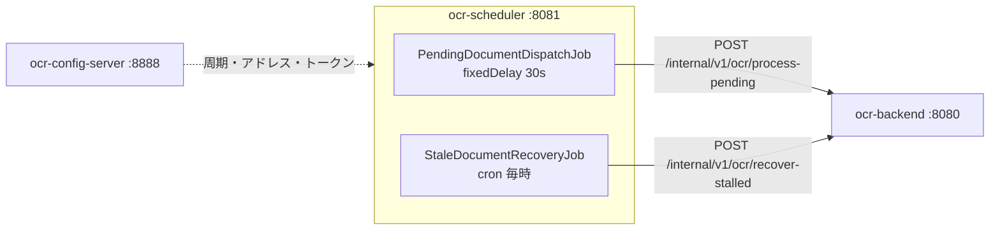

# OCR 自動化スケジューラ

[English](README.md) | [한국어](README.ko.md) | [简体中文](README.zh-CN.md) | **日本語**

> OCR 処理を決められた周期でトリガーする薄いバッチサービス。
> **「いつ処理するか」だけ**を知っていて、OCR もストレージも DB も知らない。

バッチジョブで繰り返し問題になること — 処理が周期より長引いたときの呼び出しの重なり、
ジョブから漏れた例外ひとつでスケジュールが永久に止まること、応答しない相手を待って
スレッドが塞がること — を構造で防ぐことが目標だ。

[backend](https://github.com/hyunolike/ai.ocr-automation.system-backend) はリクエストを
受けてワーカープールに**受け付けるだけで即座に 202 を返す。**
そのためこのジョブの呼び出しは短く終わり、処理結果を待たない。

<br>

## 🎯 設計目標

- **薄く保つ** — ここにビジネスロジックが積み重なり始めた時点で、分離した意味が失われる
- **ジョブを死なせない** — `@Scheduled` から例外が漏れると、そのジョブは二度とスケジュールされない
- **呼び出しを重ねない** — 処理が周期より長引いてもリクエストを押し込まない
- **周期を再デプロイなしで変える** — ジョブ周期と on/off は設定サーバーが配る

<br>

## 🚀 機能要件

### 待機ドキュメントの受け付け (`PendingDocumentDispatchJob`)

- 30 秒ごとに backend へ待機ドキュメントの処理を依頼する。(`fixed-delay`)
- 一度に渡す件数は設定で決める。(既定 20 件)
- backend がキュー飽和 (`rejected > 0`) を返してきたら **警告として区別して残す。**
  この場合は周期を延ばしても解決しない — 処理が流入に追いついていないということだ。

### 滞留ドキュメントの回収 (`StaleDocumentRecoveryJob`)

- 毎時 0 分、`PROCESSING` のまま止まっているドキュメントの回収を依頼する。
- backend インスタンスが処理途中で落ちるとドキュメントは `PROCESSING` に残る。
  **このジョブがなければ、そのドキュメントは永久に処理されない。**
- 何分経てば滞留とみなすかは backend が決める。スケジューラはトリガーするだけだ。

### 例外処理

- ジョブは**いかなる場合も例外を外に出さない。**
  - backend が落ちている場合 → 次の周期で再試行
  - レスポンスが `null` の場合
  - 予期しない例外
- backend 呼び出しの失敗は `BackendUnavailableException` で包み、
  **復旧可能な状況**であることを明確にする。

<br>

## 📄 インターフェース仕様

### 呼び出す API

backend の内部 API のみ。すべての呼び出しに共有トークンが付く。

```
X-Internal-Token: <トークン>
```

| Method | Path | レスポンス |
|---|---|---|
| `POST` | `/internal/v1/ocr/process-pending?batchSize=20` | `202 { queued, rejected, skipped }` |
| `POST` | `/internal/v1/ocr/recover-stalled` | `200 { recovered }` |

### 受け付け結果の読み方

| フィールド | 意味 | 対応 |
|---|---|---|
| `queued` | ワーカーキューに入った件数 | 正常 |
| `rejected` | キューが満杯で入れられなかった件数 | **backend の並列度を上げるかインスタンスを増やす** |
| `skipped` | 他インスタンスが先に確保した件数 | 正常（多重化時） |

`queued` は**受け付け**件数であって成功件数ではない。実際の結果はドキュメントの状態で確認する。

### 設定

ポート、backend のアドレス、ジョブ周期はすべて設定サーバーの `ocr-scheduler.yml` から降ってくる。

```yaml
ocr:
  scheduler:
    backend:
      base-url: http://localhost:8080
      internal-token: ${INTERNAL_TOKEN:local-dev-only-token}
      connect-timeout-millis: 2000
      read-timeout-millis: 5000
    jobs:
      pending-dispatch:
        enabled: true
        fixed-delay: 30s
        initial-delay: 10s
        batch-size: 20
      stale-recovery:
        enabled: true
        cron: "0 0 * * * *"
```

<br>

## 📐 プログラミング要件

- Java 21、Spring Boot 3.5.16、Spring Cloud Config Client を使う。
- **このサービスは DB にアクセスしない。** OCR エンジンもストレージも知らない。
- **`@Scheduled` メソッドは例外を外に出してはいけない。** 漏れると
  そのジョブは二度とスケジュールされない。
- 周期は `fixedRate` ではなく **`fixedDelay`** を使う。
- `RestClient` には**接続・読み取りタイムアウトを必ず設定する。** 既定値（無制限）だと
  backend が無応答のときスレッドが永久に塞がる。
- 内部トークンは **`RestClient` の既定ヘッダーで一度だけ付ける。** 呼び出し箇所ごとに
  付けていると、いつか一つ付け忘れる。
- ジョブの on/off は `@ConditionalOnProperty` で設定から切る。テストでもこれで切る。
- **コミット単位は下の機能リスト単位とする。**

<br>

## ✅ 実装する機能リスト

- [x] `SchedulerProperties` — `ocr.scheduler.*` のバインド
  - [x] 開発既定トークンの使用判定 (`usesDevToken()`)
- [x] `RestClientConfig`
  - [x] 接続 2 秒 / 読み取り 5 秒のタイムアウト
  - [x] 内部トークンの既定ヘッダー
  - [x] 開発既定トークン使用時の起動警告
- [x] `BackendClient`
  - [x] 待機ドキュメントの受け付け依頼
  - [x] 滞留ドキュメントの回収依頼
  - [x] 4xx/5xx → `BackendUnavailableException` への変換
- [x] `PendingDocumentDispatchJob` (`fixedDelay`)
  - [x] キュー飽和を警告として区別
  - [x] すべての例外をジョブ内で飲み込む
- [x] `StaleDocumentRecoveryJob` (cron)
  - [x] すべての例外をジョブ内で飲み込む
- [x] `SchedulingConfig` — スレッドプール 2
- [ ] ShedLock 分散ロック（多重化への備え） — *保留、下記参照*
- [ ] 失敗時のバックオフ再試行
- [ ] ジョブ実行履歴・メトリクス (Micrometer)
- [ ] 古いドキュメントの整理ジョブ
- [x] テスト
  - [x] ジョブの障害耐性（backend 障害・`null` レスポンス・予期しない例外）
  - [x] すべての呼び出しに内部トークンが付くか
  - [x] レスポンスの解析と例外変換
  - [x] コンテキスト起動・設定バインド

<br>

## 📤 実行結果

> ログメッセージはサービスコードからそのまま出る韓国語だ。

### 正常な受け付け

```
INFO c.o.a.s.job.PendingDocumentDispatchJob : 대기 문서 접수 완료: queued=3, skipped=0
```

### キュー飽和 — 周期を延ばしても解決しない

```
WARN c.o.a.s.job.PendingDocumentDispatchJob : backend 워커 큐가 포화 상태입니다: queued=2, rejected=18, skipped=0
```

### backend 障害 — ジョブは死なない

```
WARN c.o.a.s.job.PendingDocumentDispatchJob : backend 호출 실패. 다음 주기에 재시도합니다: 대기 문서 처리 요청에 실패했습니다: batchSize=20
```

### 滞留ドキュメントの回収

```
WARN c.o.a.s.job.StaleDocumentRecoveryJob : 정체 문서를 회수했습니다: recovered=3
```

`recovered` が 0 でなければ、**どこかで backend インスタンスが落ちているという信号**だ。

### 開発既定トークンの警告

```
WARN c.o.a.scheduler.config.RestClientConfig : 내부 토큰이 개발용 기본값입니다. 운영에서는 ocr.scheduler.backend.internal-token 을 반드시 바꾸세요.
```

<br>

## 🏗 アーキテクチャ



```
com.ocr.automation.scheduler
├── client/
│   ├── BackendClient.java              # backend 内部 API の呼び出し
│   ├── BackendUnavailableException     # 復旧可能な障害
│   └── dto/                            # DispatchResult, RecoveryResult
├── job/
│   ├── PendingDocumentDispatchJob      # 待機ドキュメント受け付けのトリガー
│   └── StaleDocumentRecoveryJob        # 滞留ドキュメントの回収
└── config/
    ├── SchedulerProperties             # ocr.scheduler.* のバインド
    ├── SchedulingConfig                # @EnableScheduling + スレッドプール
    └── RestClientConfig                # タイムアウト + 内部トークン
```

### なぜ OCR 実行をここに置かないのか

スケジューラが直接 OCR を回すと、**エンジン依存とストレージアクセスが二つのサービスに散る。**
そうなるとエンジンを差し替えるとき二箇所を直さねばならず、スケールアウトの単位も混ざる。

| | 現状 |
|---|---|
| Tesseract ネイティブ | backend イメージにだけ必要 |
| スループット不足 | backend だけ増やす。スケジューラは一台で足りる |
| エンジン差し替え | スケジューラは触る必要がない |

<br>

## 🛠 技術スタック

| 領域 | 技術 |
|---|---|
| 言語 | Java 21 |
| フレームワーク | Spring Boot 3.5.16 |
| 設定 | Spring Cloud Config Client (2025.0.3) |
| スケジューリング | Spring `@Scheduled` |
| HTTP | `RestClient` |
| ビルド | Gradle 8.14.3 |

<br>

## 🏃 実行方法

起動順序が重要だ: **設定サーバー → backend → scheduler**。

```bash
# 1. 設定サーバー (8888)
cd ../ai.ocr-automation.system-config.server && ./gradlew bootRun

# 2. バックエンド (8080)
cd ../ai.ocr-automation.system-backend && ./gradlew bootRun

# 3. スケジューラ (8081)
./gradlew bootRun
```

| 項目 | アドレス |
|---|---|
| ヘルスチェック | `http://localhost:8081/actuator/health` |

ジョブが回っているかはログで確認する。手動操作なしにドキュメントが処理されれば正常だ。

### テスト

```bash
./gradlew test
```

| テスト | 検証対象 |
|---|---|
| `SchedulerJobTest` | **いかなる場合もジョブが例外を外に出さない** |
| `BackendClientTest` | リクエスト URL とパラメータ、全呼び出しへの内部トークン付与、4xx/5xx 変換 |
| `OcrSchedulerApplicationTest` | コンテキスト起動、設定バインド |

> テストではジョブを `enabled: false` にする。有効なままだとテスト中に実際の backend を探しに行く。

<br>

## 🤔 設計で悩んだ点

| テーマ | 選択 | 理由 |
|---|---|---|
| 周期指定 | `fixedDelay`（`fixedRate` ではない） | 処理が周期より長引くと fixedRate は呼び出しを押し込み、backend をさらに圧迫する |
| 例外処理 | ジョブ内ですべて飲み込む | `@Scheduled` から例外が漏れると、そのジョブは**二度とスケジュールされない** |
| スレッドプール | `poolSize = 2` | 既定のスケジューラは単一スレッドで、一つのジョブが長引くと他が押される |
| 読み取りタイムアウト | 60 秒 → 5 秒 | backend が受け付けだけして即応答するようになった。長く待つ理由がない |
| 内部トークン | 既定ヘッダーで一度だけ | 呼び出し箇所ごとに付けていると、いつか一つ付け忘れる |
| キュー飽和 | `info` ではなく `warn` で区別 | 周期調整では解決しない状況だ。ログを見る人がすぐ気づくべきだ |
| ジョブ on/off | `@ConditionalOnProperty` | 設定だけで特定のジョブを切れる |
| 分散ロック | **保留** | 非同期受け付け以降、重複呼び出しのコストがほぼ消えた。さらに ShedLock は DB ロックテーブルを使い「スケジューラは DB を知らない」という原則を壊す |

<br>

## ⚠️ 既知の簡略化

初期構造の段階で意図的に残した部分だ。実運用の前に必ず解消しなければならない。

- **インスタンスを増やすとジョブが重複実行される** — 分散ロックがない。backend の楽観ロックがドキュメントの重複処理は防ぐが、無駄な呼び出しは倍増する。
- **開発既定トークンがある** — `local-dev-only-token` でローカルはそのまま動く。使われると起動警告が出るが、本番で `INTERNAL_TOKEN` を指定しなければ保護はない。
- **再試行ポリシーが「次の周期」だけ** — 呼び出しが失敗してもただ待つ。バックオフも即時再試行もない。
- **ジョブ実行履歴を残さない** — いつ何件処理したかはログにしかない。運用の可視性のためにメトリクスが要る。
- **失敗が通知につながらない** — backend がずっと落ちていてもログに溜まるだけだ。

<br>

## 🗺 今後実装するもの

- [ ] コンテナイメージ + CI
- [ ] ジョブ実行履歴・メトリクス収集 (Micrometer)
- [ ] 連続失敗時の通知
- [ ] 失敗時のバックオフ再試行
- [ ] トークンを設定サーバーの `{cipher}` で暗号化
- [ ] 古いドキュメントの整理ジョブを追加
- [ ] （必要になれば）ShedLock による分散ロック
