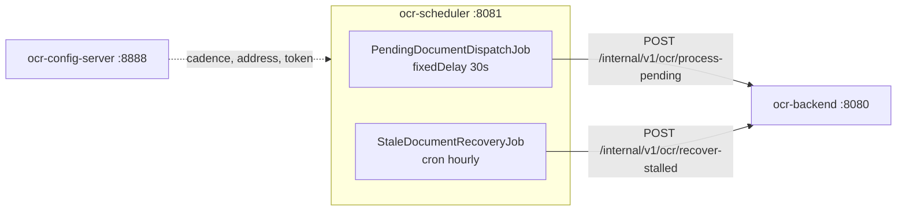

# OCR Automation Scheduler

**English** | [한국어](README.ko.md) | [简体中文](README.zh-CN.md) | [日本語](README.ja.md)

> A thin batch service that triggers OCR processing on a schedule.
> It knows **only "when"** — not OCR, not storage, not the database.

The goal is to design away the problems that keep coming up in batch jobs — calls
piling up when processing takes longer than the interval, a single escaped exception
silencing a job forever, threads pinned waiting on an unresponsive peer.

The [backend](https://github.com/hyunolike/ai.ocr-automation.system-backend) **accepts
work into a worker pool and answers 202 immediately.** So this job's calls finish fast
and never wait for the processing itself.

<br>

## 🎯 Design Goals

- **Stay thin** — the moment business logic accumulates here, the split loses its point
- **Never let a job die** — an exception escaping `@Scheduled` means that job is never scheduled again
- **Never let calls pile up** — don't push more requests in when processing runs long
- **Change intervals without redeploying** — cadence and on/off come from the config server

<br>

## 🚀 Functional Requirements

### Dispatching pending documents (`PendingDocumentDispatchJob`)

- Every 30 seconds, ask the backend to process pending documents. (`fixed-delay`)
- How many to hand over at once is configurable. (default 20)
- When the backend reports a saturated queue (`rejected > 0`), **log it as a warning.**
  Lengthening the interval will not help here — processing simply isn't keeping up with intake.

### Recovering stalled documents (`StaleDocumentRecoveryJob`)

- On the hour, ask the backend to recover documents stuck in `PROCESSING`.
- If a backend instance dies mid-processing, its document stays `PROCESSING`.
  **Without this job that document is never processed again.**
- How many minutes count as stalled is the backend's call. The scheduler only triggers.

### Error handling

- A job **never lets an exception escape**, under any circumstances.
  - The backend is down → retry on the next tick
  - The response is `null`
  - Anything unexpected
- Backend call failures are wrapped in `BackendUnavailableException` to make it explicit
  that the situation is **recoverable**.

<br>

## 📄 Interface Specification

### APIs it calls

Only the backend's internal API. Every call carries the shared token.

```
X-Internal-Token: <token>
```

| Method | Path | Response |
|---|---|---|
| `POST` | `/internal/v1/ocr/process-pending?batchSize=20` | `202 { queued, rejected, skipped }` |
| `POST` | `/internal/v1/ocr/recover-stalled` | `200 { recovered }` |

### Reading the dispatch result

| Field | Meaning | What to do |
|---|---|---|
| `queued` | Handed to the worker queue | Normal |
| `rejected` | Refused because the queue was full | **Raise backend concurrency or add instances** |
| `skipped` | Another instance claimed it first | Normal (when running several) |

`queued` is an **acceptance** count, not a success count. The real outcome shows up in
the document's status.

### Configuration

Port, backend address and job cadence all come from `ocr-scheduler.yml` on the config server.

```yaml
ocr:
  scheduler:
    backend:
      base-url: http://localhost:8080
      internal-token: ${INTERNAL_TOKEN:local-dev-only-token}
      connect-timeout-millis: 2000
      read-timeout-millis: 5000
    jobs:
      pending-dispatch:
        enabled: true
        fixed-delay: 30s
        initial-delay: 10s
        batch-size: 20
      stale-recovery:
        enabled: true
        cron: "0 0 * * * *"
```

<br>

## 📐 Programming Requirements

- Use Java 21, Spring Boot 3.5.16 and Spring Cloud Config Client.
- **This service never touches the database.** It knows nothing of the OCR engine or storage.
- **A `@Scheduled` method must not let an exception escape.** If one does,
  that job is never scheduled again.
- Use **`fixedDelay`**, not `fixedRate`.
- **Always set connect and read timeouts** on `RestClient`. Left at the default (unlimited),
  an unresponsive backend pins the thread forever.
- Attach the internal token **once, as a `RestClient` default header.** Attach it per
  call site and one will eventually be missed.
- Toggle jobs with `@ConditionalOnProperty`. Tests switch them off the same way.
- **Commit granularity follows the feature checklist below.**

<br>

## ✅ Feature Checklist

- [x] `SchedulerProperties` — binds `ocr.scheduler.*`
  - [x] Detects the development default token (`usesDevToken()`)
- [x] `RestClientConfig`
  - [x] 2s connect / 5s read timeout
  - [x] Internal token as a default header
  - [x] Startup warning when the dev default token is in use
- [x] `BackendClient`
  - [x] Dispatch pending documents
  - [x] Recover stalled documents
  - [x] 4xx/5xx → `BackendUnavailableException`
- [x] `PendingDocumentDispatchJob` (`fixedDelay`)
  - [x] Distinguishes a saturated queue as a warning
  - [x] Swallows every exception inside the job
- [x] `StaleDocumentRecoveryJob` (cron)
  - [x] Swallows every exception inside the job
- [x] `SchedulingConfig` — thread pool of 2
- [ ] ShedLock distributed lock (for multiple instances) — *deferred, see below*
- [ ] Backoff retry on failure
- [ ] Job run history and metrics (Micrometer)
- [ ] Cleanup job for old documents
- [x] Tests
  - [x] Job fault tolerance (backend down, `null` response, unexpected exception)
  - [x] Internal token attached to every call
  - [x] Response parsing and exception translation
  - [x] Context startup and property binding

<br>

## 📤 Results

> Log messages are in Korean because they come straight from the service code.

### Normal dispatch

```
INFO c.o.a.s.job.PendingDocumentDispatchJob : 대기 문서 접수 완료: queued=3, skipped=0
```

### Saturated queue — a longer interval won't fix this

```
WARN c.o.a.s.job.PendingDocumentDispatchJob : backend 워커 큐가 포화 상태입니다: queued=2, rejected=18, skipped=0
```

### Backend down — the job survives

```
WARN c.o.a.s.job.PendingDocumentDispatchJob : backend 호출 실패. 다음 주기에 재시도합니다: 대기 문서 처리 요청에 실패했습니다: batchSize=20
```

### Stalled documents recovered

```
WARN c.o.a.s.job.StaleDocumentRecoveryJob : 정체 문서를 회수했습니다: recovered=3
```

A non-zero `recovered` is **a signal that backend instances are dying somewhere.**

### Development default token warning

```
WARN c.o.a.scheduler.config.RestClientConfig : 내부 토큰이 개발용 기본값입니다. 운영에서는 ocr.scheduler.backend.internal-token 을 반드시 바꾸세요.
```

<br>

## 🏗 Architecture



```
com.ocr.automation.scheduler
├── client/
│   ├── BackendClient.java              # calls the backend's internal API
│   ├── BackendUnavailableException     # a recoverable failure
│   └── dto/                            # DispatchResult, RecoveryResult
├── job/
│   ├── PendingDocumentDispatchJob      # triggers pending-document dispatch
│   └── StaleDocumentRecoveryJob        # recovers stalled documents
└── config/
    ├── SchedulerProperties             # binds ocr.scheduler.*
    ├── SchedulingConfig                # @EnableScheduling + thread pool
    └── RestClientConfig                # timeouts + internal token
```

### Why OCR doesn't run here

If the scheduler ran OCR itself, **the engine dependency and storage access would
spread across two services.** Swapping the engine would mean editing both, and the
scale-out unit would blur.

| | As it stands |
|---|---|
| Tesseract native | needed only in the backend image |
| Not enough throughput | scale the backend; one scheduler is plenty |
| Swapping the engine | the scheduler isn't touched |

<br>

## 🛠 Tech Stack

| Area | Technology |
|---|---|
| Language | Java 21 |
| Framework | Spring Boot 3.5.16 |
| Configuration | Spring Cloud Config Client (2025.0.3) |
| Scheduling | Spring `@Scheduled` |
| HTTP | `RestClient` |
| Build | Gradle 8.14.3 |

<br>

## 🏃 Getting Started

Startup order matters: **config server → backend → scheduler.**

```bash
# 1. Config server (8888)
cd ../ai.ocr-automation.system-config.server && ./gradlew bootRun

# 2. Backend (8080)
cd ../ai.ocr-automation.system-backend && ./gradlew bootRun

# 3. Scheduler (8081)
./gradlew bootRun
```

| Item | Address |
|---|---|
| Health check | `http://localhost:8081/actuator/health` |

Watch the log to see the jobs run. If documents get processed without you touching
anything, it works.

### Tests

```bash
./gradlew test
```

| Test | What it covers |
|---|---|
| `SchedulerJobTest` | **A job never lets an exception escape, under any circumstances** |
| `BackendClientTest` | Request URL and params, internal token on every call, 4xx/5xx translation |
| `OcrSchedulerApplicationTest` | Context startup, property binding |

> Tests keep jobs `enabled: false`. Left on, they go looking for a real backend mid-test.

<br>

## 🤔 Design Decisions

| Topic | Choice | Why |
|---|---|---|
| Cadence | `fixedDelay`, not `fixedRate` | When processing outlasts the interval, fixedRate pushes calls in and leans harder on the backend |
| Error handling | Swallow everything inside the job | An exception escaping `@Scheduled` means that job is **never scheduled again** |
| Thread pool | `poolSize = 2` | The default scheduler is single-threaded; one long job delays the other |
| Read timeout | 60s → 5s | The backend now only accepts and returns. No reason to wait long |
| Internal token | Once, as a default header | Attach it per call site and one will eventually be missed |
| Saturated queue | `warn`, distinct from `info` | Tuning the interval won't help. Whoever reads the log should see that at once |
| Job toggle | `@ConditionalOnProperty` | A single job can be switched off from configuration |
| Distributed lock | **Deferred** | Since dispatch became asynchronous, duplicate calls cost almost nothing. And ShedLock needs a DB lock table, breaking "the scheduler knows nothing of the database" |

<br>

## ⚠️ Known Simplifications

Deliberately left out at this scaffolding stage. Each has to be resolved before real use.

- **Running several instances duplicates job runs** — there is no distributed lock. The backend's optimistic lock prevents double processing, but the call volume multiplies.
- **A development default token exists** — `local-dev-only-token` makes local runs work out of the box. It logs a warning when used, but without `INTERNAL_TOKEN` in production there is no protection.
- **The only retry policy is "next tick"** — a failed call just waits. There is no backoff or immediate retry.
- **No job run history** — how much was processed and when lives only in the log. Operational visibility needs metrics.
- **Failures don't raise alerts** — a permanently dead backend only accumulates log lines.

<br>

## 🗺 Roadmap

- [ ] Container image + CI
- [ ] Job run history and metrics (Micrometer)
- [ ] Alerting on consecutive failures
- [ ] Backoff retry on failure
- [ ] Encrypt the token with the config server's `{cipher}`
- [ ] A cleanup job for old documents
- [ ] (When needed) ShedLock for a distributed lock
