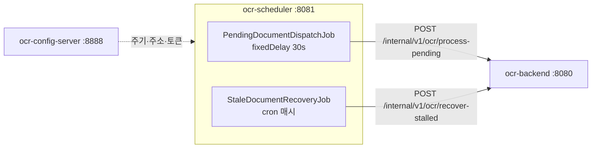

# OCR 자동화 스케줄러

> OCR 처리를 정해진 주기에 트리거하는 얇은 배치 서비스.
> **"언제 처리할지"만** 알고 OCR도 스토리지도 DB도 모른다.

배치 잡에서 반복적으로 문제가 되는 것 — 처리가 주기보다 길어질 때의 호출 중첩,
잡 안에서 새어나간 예외 하나로 스케줄이 영영 멈추는 것, 응답 없는 상대를 기다리다
스레드가 묶이는 것 — 을 구조로 막는 것이 목표다.

[backend](https://github.com/hyunolike/ai.ocr-automation.system-backend)는 요청을 받아
워커 풀에 **접수만 하고 즉시 202로 응답한다.** 그래서 이 잡의 호출은 짧게 끝나고
처리 결과를 기다리지 않는다.

<br>

## 🎯 설계 목표

- **얇게 유지한다** — 여기에 비즈니스 로직이 쌓이기 시작하면 분리한 의미가 사라진다
- **잡이 죽지 않게 한다** — `@Scheduled`에서 예외가 새어나가면 그 잡은 다시 스케줄되지 않는다
- **호출이 밀리지 않게 한다** — 처리가 주기보다 길어져도 요청을 밀어 넣지 않는다
- **주기를 재배포 없이 바꾼다** — 잡 주기와 on/off는 설정 서버가 내려준다

<br>

## 🚀 기능 요구사항

### 대기 문서 접수 (`PendingDocumentDispatchJob`)

- 30초마다 backend에 대기 문서 처리를 요청한다. (`fixed-delay`)
- 한 번에 넘길 문서 수는 설정으로 정한다. (기본 20건)
- backend가 큐 포화(`rejected > 0`)를 알려오면 **경고로 구분해 남긴다.**
  이 경우 주기를 늘려도 해결되지 않는다 — 처리가 유입을 못 따라가는 것이다.

### 정체 문서 회수 (`StaleDocumentRecoveryJob`)

- 매시 정각, `PROCESSING`에 멈춰 있는 문서를 회수하도록 요청한다.
- backend 인스턴스가 처리 도중 죽으면 문서가 `PROCESSING`에 남는다.
  **이 잡이 없으면 그 문서는 영영 처리되지 않는다.**
- 몇 분이 지나야 정체로 볼지는 backend가 정한다. 스케줄러는 트리거만 한다.

### 예외 처리

- 잡은 **어떤 경우에도 예외를 밖으로 내보내지 않는다.**
  - backend가 죽어 있는 경우 → 다음 주기에 재시도
  - 응답이 `null`인 경우
  - 예상하지 못한 예외
- backend 호출 실패는 `BackendUnavailableException`으로 감싸 **복구 가능한 상황**임을 분명히 한다.

<br>

## 📄 인터페이스 규격

### 호출하는 API

backend의 내부 API만 호출한다. 모든 호출에 공유 토큰이 붙는다.

```
X-Internal-Token: <토큰>
```

| Method | Path | 응답 |
|---|---|---|
| `POST` | `/internal/v1/ocr/process-pending?batchSize=20` | `202 { queued, rejected, skipped }` |
| `POST` | `/internal/v1/ocr/recover-stalled` | `200 { recovered }` |

### 접수 결과 해석

| 필드 | 의미 | 대응 |
|---|---|---|
| `queued` | 워커 큐에 들어간 수 | 정상 |
| `rejected` | 큐가 가득 차 넣지 못한 수 | **backend 동시성을 올리거나 인스턴스를 늘려야 한다** |
| `skipped` | 다른 인스턴스가 먼저 선점한 수 | 정상 (다중화 시) |

`queued`는 **접수** 수일 뿐 성공한 수가 아니다. 실제 결과는 문서 상태로 확인한다.

### 설정

포트, backend 주소, 잡 주기는 모두 설정 서버의 `ocr-scheduler.yml`에서 내려온다.

```yaml
ocr:
  scheduler:
    backend:
      base-url: http://localhost:8080
      internal-token: ${INTERNAL_TOKEN:local-dev-only-token}
      connect-timeout-millis: 2000
      read-timeout-millis: 5000
    jobs:
      pending-dispatch:
        enabled: true
        fixed-delay: 30s
        initial-delay: 10s
        batch-size: 20
      stale-recovery:
        enabled: true
        cron: "0 0 * * * *"
```

<br>

## 📐 프로그래밍 요구사항

- Java 21, Spring Boot 3.5.16, Spring Cloud Config Client를 사용한다.
- **이 서비스는 DB에 접근하지 않는다.** OCR 엔진도 스토리지도 모른다.
- **`@Scheduled` 메서드는 예외를 밖으로 내보내지 않는다.** 예외가 새어나가면
  해당 잡이 다시 스케줄되지 않는다.
- 주기는 `fixedRate`가 아니라 **`fixedDelay`**를 쓴다.
- `RestClient`에 **연결·읽기 타임아웃을 반드시 건다.** 기본값(무제한)이면
  backend 무응답 시 스레드가 영원히 묶인다.
- 내부 토큰은 **`RestClient` 기본 헤더로 한 번만 건다.** 호출 지점마다 붙이게 두면
  언젠가 하나를 빠뜨린다.
- 잡 on/off는 `@ConditionalOnProperty`로 설정에서 끈다. 테스트에서도 이걸로 끈다.
- **커밋 단위는 아래 기능 목록 단위로 한다.**

<br>

## ✅ 구현할 기능 목록

- [x] `SchedulerProperties` — `ocr.scheduler.*` 바인딩
  - [x] 개발 기본 토큰 사용 여부 판별 (`usesDevToken()`)
- [x] `RestClientConfig`
  - [x] 연결 2초 / 읽기 5초 타임아웃
  - [x] 내부 토큰 기본 헤더
  - [x] 개발 기본 토큰 사용 시 기동 경고
- [x] `BackendClient`
  - [x] 대기 문서 접수 요청
  - [x] 정체 문서 회수 요청
  - [x] 4xx/5xx → `BackendUnavailableException` 변환
- [x] `PendingDocumentDispatchJob` (`fixedDelay`)
  - [x] 큐 포화를 경고로 구분
  - [x] 모든 예외를 잡 안에서 삼킨다
- [x] `StaleDocumentRecoveryJob` (cron)
  - [x] 모든 예외를 잡 안에서 삼킨다
- [x] `SchedulingConfig` — 스레드 풀 2개
- [ ] ShedLock 분산 락 (다중 인스턴스 대비) — *보류, 아래 참고*
- [ ] 실패 시 백오프 재시도
- [ ] 잡 실행 이력·메트릭 (Micrometer)
- [ ] 오래된 문서 정리 잡
- [x] 테스트
  - [x] 잡 장애 내성 (backend 장애·`null` 응답·예상치 못한 예외)
  - [x] 모든 호출에 내부 토큰이 붙는지
  - [x] 응답 파싱과 예외 변환
  - [x] 컨텍스트 기동·설정 바인딩

<br>

## 📤 실행 결과

### 정상 접수

```
INFO c.o.a.s.job.PendingDocumentDispatchJob : 대기 문서 접수 완료: queued=3, skipped=0
```

### 큐 포화 — 주기를 늘려도 해결되지 않는다

```
WARN c.o.a.s.job.PendingDocumentDispatchJob : backend 워커 큐가 포화 상태입니다: queued=2, rejected=18, skipped=0
```

### backend 장애 — 잡은 죽지 않는다

```
WARN c.o.a.s.job.PendingDocumentDispatchJob : backend 호출 실패. 다음 주기에 재시도합니다: 대기 문서 처리 요청에 실패했습니다: batchSize=20
```

### 정체 문서 회수

```
WARN c.o.a.s.job.StaleDocumentRecoveryJob : 정체 문서를 회수했습니다: recovered=3
```

`recovered`가 0이 아니면 **어딘가에서 backend 인스턴스가 죽고 있다는 신호**다.

### 개발 기본 토큰 경고

```
WARN c.o.a.scheduler.config.RestClientConfig : 내부 토큰이 개발용 기본값입니다. 운영에서는 ocr.scheduler.backend.internal-token 을 반드시 바꾸세요.
```

<br>

## 🏗 아키텍처



```
com.ocr.automation.scheduler
├── client/
│   ├── BackendClient.java              # backend 내부 API 호출
│   ├── BackendUnavailableException     # 복구 가능한 장애
│   └── dto/                            # DispatchResult, RecoveryResult
├── job/
│   ├── PendingDocumentDispatchJob      # 대기 문서 접수 트리거
│   └── StaleDocumentRecoveryJob        # 정체 문서 회수
└── config/
    ├── SchedulerProperties             # ocr.scheduler.* 바인딩
    ├── SchedulingConfig                # @EnableScheduling + 스레드 풀
    └── RestClientConfig                # 타임아웃 + 내부 토큰
```

### 왜 OCR 실행을 여기 두지 않았나

스케줄러가 직접 OCR을 돌리면 **엔진 의존성과 스토리지 접근이 두 서비스로 퍼진다.**
그러면 엔진을 교체할 때 두 곳을 고쳐야 하고, 스케일아웃 단위도 뒤섞인다.

| | 지금 |
|---|---|
| Tesseract 네이티브 | backend 이미지에만 필요 |
| 처리량 부족 | backend만 늘린다. 스케줄러는 한 대면 충분 |
| 엔진 교체 | 스케줄러는 손댈 일이 없다 |

<br>

## 🛠 기술 스택

| 영역 | 기술 |
|---|---|
| 언어 | Java 21 |
| 프레임워크 | Spring Boot 3.5.16 |
| 설정 | Spring Cloud Config Client (2025.0.3) |
| 스케줄링 | Spring `@Scheduled` |
| HTTP | `RestClient` |
| 빌드 | Gradle 8.14.3 |

<br>

## 🏃 실행 방법

기동 순서가 있다: **설정 서버 → backend → scheduler**.

```bash
# 1. 설정 서버 (8888)
cd ../ai.ocr-automation.system-config.server && ./gradlew bootRun

# 2. 백엔드 (8080)
cd ../ai.ocr-automation.system-backend && ./gradlew bootRun

# 3. 스케줄러 (8081)
./gradlew bootRun
```

| 항목 | 주소 |
|---|---|
| 헬스체크 | `http://localhost:8081/actuator/health` |

잡이 도는지는 로그로 확인한다. 수동 개입 없이 문서가 처리되면 정상이다.

### 테스트

```bash
./gradlew test
```

| 테스트 | 검증 대상 |
|---|---|
| `SchedulerJobTest` | **어떤 경우에도 잡이 예외를 밖으로 내보내지 않는다** |
| `BackendClientTest` | 요청 URL·파라미터, 모든 호출에 내부 토큰 부착, 4xx/5xx 변환 |
| `OcrSchedulerApplicationTest` | 컨텍스트 기동, 설정 바인딩 |

> 테스트에서는 잡을 `enabled: false`로 꺼둔다. 켜두면 테스트 도중 실제로 backend를 찾아 나선다.

<br>

## 🤔 설계하며 고민한 점

| 주제 | 선택 | 이유 |
|---|---|---|
| 주기 지정 | `fixedDelay` (`fixedRate` 아님) | 처리가 주기보다 오래 걸릴 때 fixedRate는 호출을 밀어 넣어 backend를 더 밀어붙인다 |
| 예외 처리 | 잡 안에서 전부 삼킨다 | `@Scheduled`에서 예외가 새어나가면 그 잡은 **다시 스케줄되지 않는다** |
| 스레드 풀 | `poolSize = 2` | 기본 스케줄러는 단일 스레드라 한 잡이 오래 걸리면 다른 잡이 밀린다 |
| 읽기 타임아웃 | 60초 → 5초 | backend가 접수만 하고 즉시 응답하도록 바뀌었다. 길게 잡을 이유가 없다 |
| 내부 토큰 | `RestClient` 기본 헤더로 한 번만 | 호출 지점마다 붙이게 두면 언젠가 하나를 빠뜨린다 |
| 큐 포화 | `info`가 아니라 `warn`으로 구분 | 주기 조정으로 해결되지 않는 상황이다. 로그를 보는 사람이 바로 알아야 한다 |
| 잡 on/off | `@ConditionalOnProperty` | 설정만으로 특정 잡을 끌 수 있다 |
| 분산 락 | **보류** | 비동기 접수 이후 중복 호출 비용이 거의 사라졌다. 게다가 ShedLock은 DB 락 테이블을 써서 "스케줄러는 DB를 모른다"는 원칙을 깬다 |

<br>

## ⚠️ 알려진 단순화

초기 구조 단계로 의도적으로 남겨둔 부분이다. 실전 적용 전에 반드시 해소해야 한다.

- **인스턴스를 늘리면 잡이 중복 실행된다** — 분산 락이 없다. backend의 낙관적 락이 문서 중복 처리는 막아주지만 불필요한 호출이 배수로 는다.
- **개발 기본 토큰이 있다** — `local-dev-only-token`으로 로컬이 그냥 돈다. 쓰이면 기동 경고가 뜨지만, 운영에서 `INTERNAL_TOKEN`을 지정하지 않으면 보호가 없다.
- **재시도 정책이 "다음 주기"뿐이다** — 호출이 실패하면 그냥 기다린다. 백오프나 즉시 재시도가 없다.
- **잡 실행 이력을 남기지 않는다** — 언제 몇 건을 처리했는지 로그에만 있다. 운영 가시성을 위해 메트릭이 필요하다.
- **실패가 알림으로 이어지지 않는다** — backend가 계속 죽어 있어도 로그에만 쌓인다.

<br>

## 🗺 앞으로 구현할 것

- [ ] 컨테이너 이미지 + CI
- [ ] 잡 실행 이력·메트릭 수집 (Micrometer)
- [ ] 연속 실패 시 알림
- [ ] 실패 시 백오프 재시도
- [ ] 토큰을 설정 서버 `{cipher}`로 암호화
- [ ] 오래된 문서 정리 잡 추가
- [ ] (필요해지면) ShedLock으로 분산 락
