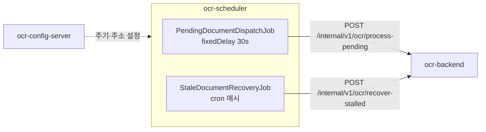

# ai.ocr-automation.system-backend.scheduler

OCR 자동화 시스템의 **스케줄러**. 배치 잡을 정해진 주기에 돌린다.

이 서비스는 **"언제 처리할지"만** 안다. OCR 엔진도 스토리지도 DB 도 모르고,
[backend](https://github.com/hyunolike/ai.ocr-automation.system-backend)의 내부 API 를 호출하기만 한다.

backend 는 요청을 받아 **워커 풀에 접수만 하고 즉시 202 로 응답한다.** 그래서 이 잡의
호출은 짧게 끝나고, 처리 결과를 기다리지 않는다.

<br>

## 🎯 왜 분리했나

OCR 처리 로직을 여기 두지 않은 이유:

- **엔진 의존성을 한곳에 모은다** — Tesseract 네이티브 라이브러리가 필요한 쪽은 backend 뿐이다
- **독립적으로 늘리고 줄인다** — 처리량이 필요하면 backend 만 늘리면 된다. 스케줄러는 한 대면 충분하다
- **잡 주기를 바꿔도 backend 를 재배포하지 않는다** — 주기는 설정 서버가 내려준다

바꿔 말하면 스케줄러는 **얇은 트리거**다. 여기에 비즈니스 로직이 쌓이기 시작하면
분리한 의미가 사라진다.

<br>

## ⏰ 잡

| 잡 | 주기 | 하는 일 |
|---|---|---|
| `PendingDocumentDispatchJob` | `fixed-delay` 30초 | 대기 중인 문서를 backend 워커 풀에 접수시킨다 |
| `StaleDocumentRecoveryJob` | cron 매시 정각 | 중단된 채 `PROCESSING` 에 멈춘 문서를 회수한다 |



### 회수 잡이 왜 필요한가

backend 인스턴스가 OCR 처리 도중 죽으면 문서는 `PROCESSING` 상태로 남는다.
아무도 손대지 않으면 **영영 처리되지 않는다.** 이 잡이 일정 시간이 지난 문서를
`PENDING` 으로 돌려놓아 다음 주기에 다시 집히게 한다.

눈에 덜 띄지만 파이프라인이 막히지 않게 하는 것은 이쪽이다.

<br>

## 🧱 설계상 선택

| 주제 | 선택 | 이유 |
|---|---|---|
| 주기 지정 | `fixedDelay` (`fixedRate` 아님) | 처리가 주기보다 오래 걸릴 때 fixedRate 는 호출을 밀어 넣어 backend 를 더 밀어붙인다. fixedDelay 는 이전 실행이 **끝난 뒤부터** 세므로 밀리지 않는다 |
| 예외 처리 | 잡 안에서 전부 삼킨다 | `@Scheduled` 메서드에서 예외가 새어나가면 그 잡은 **다시 스케줄되지 않는다.** backend 가 잠깐 죽었다고 스케줄러가 영영 멈추면 안 된다 |
| 스레드 풀 | `poolSize = 2` | 기본 스케줄러는 단일 스레드라 한 잡이 오래 걸리면 다른 잡이 밀린다 |
| 타임아웃 | 연결 2초 / 읽기 5초 | 기본값(무제한)이면 backend 무응답 시 스레드가 영원히 묶인다. **backend 가 접수만 하고 즉시 응답**하므로 읽기를 길게 잡을 이유가 없다 |
| 잡 on/off | `@ConditionalOnProperty` | 설정만으로 특정 잡을 끌 수 있다. 테스트에서도 이걸로 끈다 |
| 내부 토큰 | `RestClient` 기본 헤더로 한 번만 | 호출 지점마다 붙이게 두면 언젠가 하나를 빠뜨린다 |

<br>

## ⚙️ 설정

포트, backend 주소, 잡 주기는 모두
[ocr-config-server](https://github.com/hyunolike/ai.ocr-automation.system-config.server)의
`ocr-scheduler.yml` 에서 내려온다.

```yaml
ocr:
  scheduler:
    backend:
      base-url: http://localhost:8080
      # backend 의 /internal 을 부를 때 제시하는 토큰. backend 쪽 값과 같아야 한다
      internal-token: ${INTERNAL_TOKEN:local-dev-only-token}
      connect-timeout-millis: 2000
      read-timeout-millis: 5000
    jobs:
      pending-dispatch:
        enabled: true
        fixed-delay: 30s
        initial-delay: 10s
        batch-size: 20
      stale-recovery:
        enabled: true
        cron: "0 0 * * * *"
```

<br>

## 🏗 패키지 구조

```
com.ocr.automation.scheduler
├── client/
│   ├── BackendClient.java              # backend 내부 API 호출
│   ├── BackendUnavailableException     # 복구 가능한 장애
│   └── dto/                            # ProcessingSummary, RecoveryResult
├── job/
│   ├── PendingDocumentDispatchJob      # 대기 문서 처리 트리거
│   └── StaleDocumentRecoveryJob        # 정체 문서 회수
└── config/
    ├── SchedulerProperties             # ocr.scheduler.* 바인딩
    ├── SchedulingConfig                # @EnableScheduling + 스레드 풀
    └── RestClientConfig                # 타임아웃 건 RestClient
```

<br>

## 🏃 실행

기동 순서가 있다: **설정 서버 → backend → scheduler**.

```bash
# 1) 설정 서버 (8888)
cd ../ai.ocr-automation.system-config.server && ./gradlew bootRun

# 2) 백엔드 (8080)
cd ../ai.ocr-automation.system-backend && ./gradlew bootRun

# 3) 스케줄러 (8081)
./gradlew bootRun
```

| 항목 | 주소 |
|---|---|
| 헬스체크 | `http://localhost:8081/actuator/health` |

잡이 도는지는 로그로 확인한다.

```
대기 문서 접수 완료: queued=3, skipped=0
```

backend 의 워커 큐가 가득 차면 경고가 남는다. 이때는 **주기를 늘려도 해결되지 않는다** —
처리가 유입을 못 따라가는 것이므로 backend 의 `ocr.processing.concurrency` 를 올리거나
인스턴스를 늘려야 한다.

```
backend 워커 큐가 포화 상태입니다: queued=2, rejected=18, skipped=0
```

### 테스트

```bash
./gradlew test
```

| 테스트 | 검증 대상 |
|---|---|
| `SchedulerJobTest` | **어떤 경우에도 잡이 예외를 밖으로 내보내지 않는다** (backend 장애, null 응답, 예상치 못한 예외) |
| `BackendClientTest` | 요청 URL·파라미터, **모든 호출에 내부 토큰 부착**, 응답 파싱, 4xx/5xx → 복구 가능 예외 변환 |
| `OcrSchedulerApplicationTest` | 컨텍스트 기동, 설정 바인딩 |

> 테스트에서는 잡을 `enabled: false` 로 꺼둔다. 켜두면 테스트 도중 실제로 backend 를 찾아 나선다.

<br>

## 🛠 기술 스택

| 영역 | 기술 |
|---|---|
| 언어 | Java 21 |
| 프레임워크 | Spring Boot 3.5.16 |
| 설정 | Spring Cloud Config Client (2025.0.3) |
| 스케줄링 | Spring `@Scheduled` |
| HTTP | `RestClient` |
| 빌드 | Gradle 8.14.3 |

<br>

## ⚠️ 알려진 한계

초기 구조 단계라 의도적으로 비워둔 부분. 실사용 전에 각각 해결해야 한다.

- **인스턴스를 늘리면 잡이 중복 실행된다** — 분산 락이 없다. 두 대를 띄우면 같은 배치를 동시에 돌린다. backend 의 낙관적 락이 문서 중복 처리는 막아주지만, 불필요한 호출이 두 배가 된다. **ShedLock 같은 분산 락이 필요하다.**
- **개발 기본 토큰이 있다** — `local-dev-only-token` 으로 로컬이 그냥 돈다. 쓰이면 기동 경고가 뜨지만, 운영에서 `INTERNAL_TOKEN` 을 지정하지 않으면 보호가 없다.
- **재시도 정책이 "다음 주기"뿐이다** — 호출이 실패하면 그냥 다음 주기를 기다린다. 백오프나 즉시 재시도가 없다.
- **잡 실행 이력을 남기지 않는다** — 언제 몇 건을 처리했는지 로그에만 있다. 운영 가시성을 위해 실행 이력 테이블이나 메트릭이 필요하다.
- **실패가 알림으로 이어지지 않는다** — backend 가 계속 죽어 있어도 로그에만 쌓인다.

<br>

## 🗺 앞으로

- [ ] ShedLock 으로 분산 락 적용 (다중 인스턴스 대비)
- [ ] 토큰을 설정 서버 `{cipher}` 로 암호화 (Phase 1.5)
- [ ] 실패 시 백오프 재시도
- [ ] 잡 실행 이력·메트릭 수집 (Micrometer)
- [ ] 연속 실패 시 알림
- [ ] 오래된 문서 정리 잡 추가
