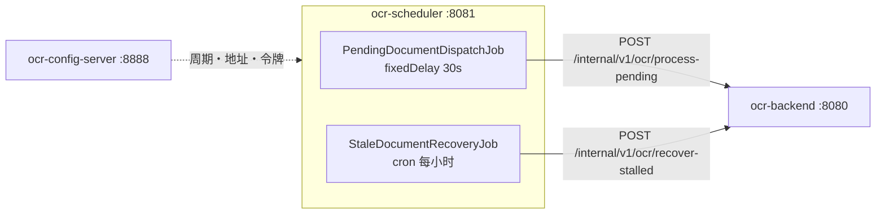

# OCR 自动化调度器

[English](README.md) | [한국어](README.ko.md) | **简体中文** | [日本語](README.ja.md)

> 按固定周期触发 OCR 处理的轻量批处理服务。
> 它**只知道"何时处理"**——不了解 OCR、存储，也不接触数据库。

批处理作业中反复出现的问题——处理时间超过周期导致调用堆积、一个漏出的异常让调度永久停止、
等待无响应的对端导致线程被占住——本服务的目标是用结构来规避这些问题。

[backend](https://github.com/hyunolike/ai.ocr-automation.system-backend) 收到请求后
**只把任务放进工作线程池并立即返回 202**。因此本作业的调用很快结束，不会等待处理结果。

<br>

## 🎯 设计目标

- **保持轻薄**——一旦业务逻辑在这里堆积，拆分就失去了意义
- **不让作业死掉**——异常从 `@Scheduled` 漏出后，该作业不会再被调度
- **不让调用堆积**——即使处理时间超过周期，也不继续塞入请求
- **无需重新部署即可调整周期**——周期与开关由配置服务器下发

<br>

## 🚀 功能需求

### 待处理文档派发 (`PendingDocumentDispatchJob`)

- 每 30 秒请求 backend 处理待处理文档。(`fixed-delay`)
- 一次派发的文档数由配置决定。(默认 20 件)
- 当 backend 报告队列饱和 (`rejected > 0`) 时，**以警告级别单独记录。**
  这种情况延长周期也无济于事——处理速度跟不上流入速度。

### 停滞文档回收 (`StaleDocumentRecoveryJob`)

- 每小时整点，请求回收卡在 `PROCESSING` 状态的文档。
- backend 实例在处理途中宕机时，文档会停留在 `PROCESSING`。
  **没有这个作业，该文档将永远得不到处理。**
- 多少分钟算停滞由 backend 决定。调度器只负责触发。

### 异常处理

- 作业在**任何情况下都不会把异常抛到外面**。
  - backend 宕机 → 下个周期重试
  - 响应为 `null`
  - 预料之外的异常
- backend 调用失败包装为 `BackendUnavailableException`，明确表示这是**可恢复的状况**。

<br>

## 📄 接口规格

### 调用的 API

只调用 backend 的内部 API。所有调用都带共享令牌。

```
X-Internal-Token: <令牌>
```

| Method | Path | 响应 |
|---|---|---|
| `POST` | `/internal/v1/ocr/process-pending?batchSize=20` | `202 { queued, rejected, skipped }` |
| `POST` | `/internal/v1/ocr/recover-stalled` | `200 { recovered }` |

### 派发结果的解读

| 字段 | 含义 | 应对 |
|---|---|---|
| `queued` | 进入工作队列的数量 | 正常 |
| `rejected` | 队列已满未能放入的数量 | **需要提高 backend 并发数或增加实例** |
| `skipped` | 被其他实例先抢占的数量 | 正常（多实例时） |

`queued` 只是**受理**数量，不是成功数量。实际结果要看文档状态。

### 配置

端口、backend 地址、作业周期全部由配置服务器的 `ocr-scheduler.yml` 下发。

```yaml
ocr:
  scheduler:
    backend:
      base-url: http://localhost:8080
      internal-token: ${INTERNAL_TOKEN:local-dev-only-token}
      connect-timeout-millis: 2000
      read-timeout-millis: 5000
    jobs:
      pending-dispatch:
        enabled: true
        fixed-delay: 30s
        initial-delay: 10s
        batch-size: 20
      stale-recovery:
        enabled: true
        cron: "0 0 * * * *"
```

<br>

## 📐 编程要求

- 使用 Java 21、Spring Boot 3.5.16、Spring Cloud Config Client。
- **本服务不访问数据库。** 不了解 OCR 引擎，也不了解存储。
- **`@Scheduled` 方法不得让异常漏出。** 一旦漏出，该作业不会再被调度。
- 周期使用 **`fixedDelay`** 而非 `fixedRate`。
- **必须为 `RestClient` 设置连接和读取超时。** 保持默认（无限）时，
  backend 无响应会让线程被永久占住。
- 内部令牌**只在 `RestClient` 默认请求头中设置一次**。若在每个调用点分别添加，
  终有一天会漏掉一处。
- 作业开关用 `@ConditionalOnProperty` 从配置控制。测试中也用同样方式关闭。
- **提交粒度以下面的功能清单为单位。**

<br>

## ✅ 功能清单

- [x] `SchedulerProperties`——绑定 `ocr.scheduler.*`
  - [x] 判别是否使用开发默认令牌 (`usesDevToken()`)
- [x] `RestClientConfig`
  - [x] 连接 2 秒 / 读取 5 秒超时
  - [x] 内部令牌默认请求头
  - [x] 使用开发默认令牌时启动告警
- [x] `BackendClient`
  - [x] 待处理文档派发请求
  - [x] 停滞文档回收请求
  - [x] 4xx/5xx → `BackendUnavailableException`
- [x] `PendingDocumentDispatchJob` (`fixedDelay`)
  - [x] 将队列饱和单独作为警告
  - [x] 在作业内吞掉所有异常
- [x] `StaleDocumentRecoveryJob` (cron)
  - [x] 在作业内吞掉所有异常
- [x] `SchedulingConfig`——线程池 2 个
- [ ] ShedLock 分布式锁（应对多实例）——*暂缓，见下文*
- [ ] 失败时退避重试
- [ ] 作业执行历史与指标 (Micrometer)
- [ ] 清理陈旧文档的作业
- [x] 测试
  - [x] 作业容错（backend 故障、`null` 响应、预料之外的异常）
  - [x] 所有调用是否都带上内部令牌
  - [x] 响应解析与异常转换
  - [x] 上下文启动与配置绑定

<br>

## 📤 运行结果

> 日志消息为韩文，因为直接来自服务代码。

### 正常派发

```
INFO c.o.a.s.job.PendingDocumentDispatchJob : 대기 문서 접수 완료: queued=3, skipped=0
```

### 队列饱和——延长周期解决不了

```
WARN c.o.a.s.job.PendingDocumentDispatchJob : backend 워커 큐가 포화 상태입니다: queued=2, rejected=18, skipped=0
```

### backend 故障——作业不会死

```
WARN c.o.a.s.job.PendingDocumentDispatchJob : backend 호출 실패. 다음 주기에 재시도합니다: 대기 문서 처리 요청에 실패했습니다: batchSize=20
```

### 停滞文档回收

```
WARN c.o.a.s.job.StaleDocumentRecoveryJob : 정체 문서를 회수했습니다: recovered=3
```

`recovered` 不为 0 就是**某处的 backend 实例正在宕机的信号**。

### 开发默认令牌告警

```
WARN c.o.a.scheduler.config.RestClientConfig : 내부 토큰이 개발용 기본값입니다. 운영에서는 ocr.scheduler.backend.internal-token 을 반드시 바꾸세요.
```

<br>

## 🏗 架构



```
com.ocr.automation.scheduler
├── client/
│   ├── BackendClient.java              # 调用 backend 内部 API
│   ├── BackendUnavailableException     # 可恢复的故障
│   └── dto/                            # DispatchResult, RecoveryResult
├── job/
│   ├── PendingDocumentDispatchJob      # 待处理文档派发触发
│   └── StaleDocumentRecoveryJob        # 停滞文档回收
└── config/
    ├── SchedulerProperties             # 绑定 ocr.scheduler.*
    ├── SchedulingConfig                # @EnableScheduling + 线程池
    └── RestClientConfig                # 超时 + 内部令牌
```

### 为什么 OCR 不放在这里

如果调度器自己跑 OCR，**引擎依赖和存储访问会分散到两个服务。**
那样更换引擎时要改两处，横向扩展的单位也会混在一起。

| | 现状 |
|---|---|
| Tesseract 原生库 | 只有 backend 镜像需要 |
| 吞吐量不足 | 只扩 backend。调度器一台足够 |
| 更换引擎 | 调度器无需改动 |

<br>

## 🛠 技术栈

| 领域 | 技术 |
|---|---|
| 语言 | Java 21 |
| 框架 | Spring Boot 3.5.16 |
| 配置 | Spring Cloud Config Client (2025.0.3) |
| 调度 | Spring `@Scheduled` |
| HTTP | `RestClient` |
| 构建 | Gradle 8.14.3 |

<br>

## 🏃 运行方式

启动顺序很重要：**配置服务器 → backend → scheduler**。

```bash
# 1. 配置服务器 (8888)
cd ../ai.ocr-automation.system-config.server && ./gradlew bootRun

# 2. 后端 (8080)
cd ../ai.ocr-automation.system-backend && ./gradlew bootRun

# 3. 调度器 (8081)
./gradlew bootRun
```

| 项目 | 地址 |
|---|---|
| 健康检查 | `http://localhost:8081/actuator/health` |

作业是否运行通过日志确认。不做任何手动操作而文档被处理，就说明正常。

### 测试

```bash
./gradlew test
```

| 测试 | 验证对象 |
|---|---|
| `SchedulerJobTest` | **作业在任何情况下都不把异常抛到外面** |
| `BackendClientTest` | 请求 URL 与参数、所有调用附带内部令牌、4xx/5xx 转换 |
| `OcrSchedulerApplicationTest` | 上下文启动、配置绑定 |

> 测试中把作业设为 `enabled: false`。开着的话测试过程中会真的去找 backend。

<br>

## 🤔 设计考量

| 主题 | 选择 | 理由 |
|---|---|---|
| 周期方式 | `fixedDelay`（而非 `fixedRate`） | 处理时间超过周期时，fixedRate 会塞入调用，对 backend 施加更大压力 |
| 异常处理 | 在作业内全部吞掉 | 异常从 `@Scheduled` 漏出后，该作业**不会再被调度** |
| 线程池 | `poolSize = 2` | 默认调度器是单线程，一个作业耗时长会拖住另一个 |
| 读取超时 | 60 秒 → 5 秒 | backend 改为只受理后立即响应，没有理由等待太久 |
| 内部令牌 | 默认请求头中只设一次 | 在每个调用点分别添加，终有一天会漏掉一处 |
| 队列饱和 | 用 `warn` 而非 `info` 区分 | 调整周期解决不了的状况，看日志的人应该立刻察觉 |
| 作业开关 | `@ConditionalOnProperty` | 仅靠配置就能关掉某个作业 |
| 分布式锁 | **暂缓** | 改为异步受理后，重复调用的成本几乎消失。而且 ShedLock 使用数据库锁表，会破坏"调度器不接触数据库"的原则 |

<br>

## ⚠️ 已知简化

初期结构阶段有意保留的部分。实际投产前必须逐一解决。

- **增加实例会导致作业重复执行**——没有分布式锁。backend 的乐观锁能防止文档被重复处理，但无谓的调用会成倍增加。
- **存在开发默认令牌**——`local-dev-only-token` 让本地直接可跑。使用时会有启动告警，但生产环境不指定 `INTERNAL_TOKEN` 就等于没有保护。
- **重试策略只有"下个周期"**——调用失败就只是等待，没有退避或立即重试。
- **不记录作业执行历史**——何时处理了多少件只存在于日志中。为了运维可见性需要指标。
- **失败不会触发告警**——backend 一直宕机也只是在日志里堆积。

<br>

## 🗺 后续计划

- [ ] 容器镜像 + CI
- [ ] 作业执行历史与指标采集 (Micrometer)
- [ ] 连续失败时告警
- [ ] 失败时退避重试
- [ ] 用配置服务器的 `{cipher}` 加密令牌
- [ ] 增加清理陈旧文档的作业
- [ ] （需要时）用 ShedLock 实现分布式锁
